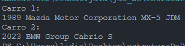

# Aula 3 - Exercícios 2

### UNIVERSIDADE PRESBITERIANA MACKENZIE
**Faculdade de Computação e Informática**<br>
Prof. Dr. Ivan Carlos Alcântara de Oliveira

**Estruturas de Dados I**

**Conceitos Básicos de Java**

| Nome do Integrante (ordem alfabética) | TIA |
| --- | --- |
| Lidia Carolina de Andrade Rosa | 32281374 |

[https://github.com/legolidia/estruturaDeDados.git](https://github.com/legolidia/estruturaDeDados/tree/main/atividade02)

- Exercício 1
    
    **Carro**
    
    ```java
    package ex01;
    
    public class Carro {
    	private int ano;
    	private String marca;
    	private String modelo;
    	private String categoria;
    	
    	public Carro() {
    		
    	}
    	
    	public Carro(int ano, String marca, String modelo,String categoria) {
    		this.ano = ano;
    		this.marca = marca;
    		this.modelo = modelo;
    		this.categoria = categoria;
    	}
    	
    	public void setAno(int ano) {
    		this.ano = ano;
    	}
    	
    	public int getAno() {
    		return ano;
    	}
    	
    	public void setMarca(String marca) {
    		this.marca = marca;
    	}
    	
    	public String getMarca(){
    		return marca;
    	}
    	
    	public void setModelo(String modelo) {
    		this.modelo = modelo;
    	}
    	
    	public String getModelo() {
    		return modelo;
    	}
    	
    	public void setCategoria(String categoria) {
    		this.categoria = categoria;
    	}
    	
    	public String getCategoria() {
    		return categoria;
    	}
    	
    }
    ```
    
    ********Main********
    
    ```java
    package ex01;
    
    public class Main {
    	public static void main(String[] args) {
    
    		Carro miata = new Carro();
    
    		miata.setAno(1989);
    		miata.setMarca("Mazda Motor Corporation");
    		miata.setModelo("MX-5");
    		miata.setCategoria("JDM");
    
    		Carro miniCooper = new Carro(2023, "BMW Group", "Cabrio", "S");
    
    		System.out.println(
    				"Carro 1: \n" + miata.getAno() + " " + miata.getMarca() + " " + miata.getModelo() + " " + miata.getCategoria());
    		System.out.println("Carro 2: \n" + miniCooper.getAno() + " " + miniCooper.getMarca() + " " + miniCooper.getModelo()
    				+ " " + miniCooper.getCategoria());
    
    	}
    }
    ```
    
    Teste:
    
    
    

- Exercício 2
    
    **************Circulo**************
    
    ```java
    package ex02;
    
    public class Circulo {
    	private float raio;
    
    	public Circulo(float raio) {
    		this.raio = raio;
    	}
    
    	public void setRaio(float raio) {
    		if (raio > 0)
    			this.raio = raio;
    		else
    			System.out.println("raio deve ser positivo");
    	}
    
    	public float getRaio() {
    		return raio;
    	}
    
    	public float calculaDiametro() {
    		return raio * 2;
    	}
    
    	public float calculaArea() {
    		return (float) (Math.PI * Math.pow(raio, 2));
    	}
    
    	public void mostraDados() {
    		System.out
    				.println("Raio: " + this.getRaio() + "\nDiametro: " + this.calculaDiametro() + "\nArea: " + this.calculaArea());
    	}
    }
    ```
    
    ************Main:************
    
    ```java
    package ex02;
    
    public class Main {
    	public static void main(String[] args) {
    		Circulo c = new Circulo(5);
    		
    		c.setRaio(-3);
    		c.setRaio(7);
    
    		c.mostraDados();
    	}
    }
    ```
    
    Teste:
    
    
    
- Exercício 3
    
    **********************Trabalhador**********************
    
    ```java
    package ex03;
    
    public class Trabalhador {
    	private String nome;
    	private float salario;
    	private String cpf;
    	private int idade;
    	private char sexo;
    	private String endereco;
    
    	public Trabalhador() {
    	}
    
    	public Trabalhador(String nome, float salario, String cpf, int idade, char sexo, String endereco) {
    		this.nome = nome;
    		this.salario = salario;
    		this.cpf = cpf;
    		this.idade = idade;
    		this.sexo = sexo;
    		this.endereco = endereco;
    	}
    
    	public void setNome(String nome) {
    		this.nome = nome;
    	}
    
    	public void setSalario(float salario) {
    		this.salario = salario;
    	}
    
    	public void setCpf(String cpf) {
    		this.cpf = cpf;
    	}
    
    	public void setIdade(int idade) {
    		this.idade = idade;
    	}
    
    	public void setSexo(char sexo) {
    		this.sexo = sexo;
    	}
    
    	public void setEndereco(String endereco) {
    		this.endereco = endereco;
    	}
    
    	public String getNome() {
    		return this.nome;
    	}
    
    	public float getSalario() {
    		return this.salario;
    	}
    
    	public String getCpf() {
    		return this.cpf;
    	}
    
    	public int getIdade() {
    		return this.idade;
    	}
    
    	public char getSexo() {
    		return this.sexo;
    	}
    
    	public String getEndereco() {
    		return this.endereco;
    	}
    
    	public void mostra() {
    		System.out.println("Nome: " + this.nome);
    		System.out.format("Salário: R$%.2f\n", this.salario);
    		System.out.println("CPF: " + this.cpf);
    		System.out.println("Idade: " + this.idade);
    		System.out.println("Sexo: " + this.sexo);
    		System.out.println("Endereço: " + this.endereco);
    	}
    
    	public void calculaSalarioAnual() {
    		System.out.format("Salário anual: R$%.2f\n", this.salario * 12);
    	}
    
    }
    ```
    
    **Main**
    
    ```java
    package ex03;
    
    import java.util.*;
    
    public class Main {
    	public static void main(String[] args) {
    		final int MAX_TRABALHADOR = 50;
    		Trabalhador[] trabalhadores = new Trabalhador[MAX_TRABALHADOR];
    		Scanner scan = new Scanner(System.in);
    
    		System.out.println("\nDigite o número de trabalhadores:");
    		int n = scan.nextInt();
    
    		while (n > MAX_TRABALHADOR || n <= 0) {
    			System.out.println("\nNúmero de trabalhadores inválido. Digite novamente:");
    			n = scan.nextInt();
    		}
    		
    		scan.nextLine();
    
    		System.out.println("\nDigite os dados dos trabalhadores:");
    
    		for (int i = 0; i < n; i++) {
    			System.out.println("\nTrabalhador " + (i + 1) + ":");
    
    			System.out.println("Nome: ");
    			String nome = scan.nextLine();
    
    			System.out.println("Salário: ");
    			float salario = Float.parseFloat(scan.nextLine());
    
    			System.out.println("CPF: ");
    			String cpf = scan.nextLine();
    
    			System.out.println("Idade: ");
    			int idade = Integer.parseInt(scan.nextLine());
    
    			System.out.println("Sexo: (M ou F)");
    			char sexo = scan.nextLine().charAt(0);
    			sexo = Character.toUpperCase(sexo);
    
    			System.out.println("Endereço: ");
    			String endereco = scan.nextLine();
    
    			trabalhadores[i] = new Trabalhador(nome, salario, cpf, idade, sexo, endereco);
    		}
    
    		float mediaSalario = 0.0f;
    
    		float maiorSalario = trabalhadores[0].getSalario();
    		Trabalhador trabMaiorSalario = trabalhadores[0];
    
    		float menorSalarioMulher = 0f;
    		Trabalhador trabMenorSalarioMulher = new Trabalhador();
    
    		for (int i = 0; i < n; i++) {
    			mediaSalario += trabalhadores[i].getSalario();
    
    			if (trabalhadores[i].getSalario() > maiorSalario) {
    				maiorSalario = trabalhadores[i].getSalario();
    				trabMaiorSalario = trabalhadores[i];
    			}
    		}
    
    		mediaSalario /= n;
    
    		System.out.format("\nA média salarial é de R$%.2f", mediaSalario);
    
    		System.out.println("\n\nHomens com salário acima da média:");
    		int j = 0;
    
    		for (int i = 0; i < n; i++) 
    			if (trabalhadores[i].getSalario() > mediaSalario && trabalhadores[i].getSexo() == 'M') {
    				trabalhadores[i].mostra();
    				j++;
    			}
    		
    		if (j == 0)
    			System.out.println("Não há homens com salário acima da média.");
    
    		double mediaAcima30 = 0.0;
    
    		for (int i = 0; i < n; i++)
    			if (trabalhadores[i].getIdade() > 30 && trabalhadores[i].getSexo() == 'M')
    				mediaAcima30 += trabalhadores[i].getSalario();
    
    		mediaAcima30 /= n;
    
    		System.out.println("\nA média salarial de homens com mais de 30 anos é de R$" + mediaAcima30 + "\n");
    
    		int qtdAbaixoMedia = 0;
    
    		for (int i = 0; i < n; i++)
    			if (trabalhadores[i].getSalario() < mediaAcima30 && trabalhadores[i].getSexo() == 'M')
    				qtdAbaixoMedia++;
    
    		if (qtdAbaixoMedia > 0)
    			System.out.println((qtdAbaixoMedia == 1)
    					? "\n" + qtdAbaixoMedia + " homem ganha abaixo da média salarial de homens com mais de 30 anos."
    					: "\n" + qtdAbaixoMedia + " homens ganham abaixo da média salarial de homens com mais de 30 anos.");
    		else
    			System.out.println("\nNão há homens com salário abaixo da média salarial de homens com mais de 30 anos.");
    
    		System.out
    				.format("\nO trabalhador que ganha mais é " + trabMaiorSalario.getNome() + " com salário de R$%.2f\n",
    						maiorSalario);
    
    		trabMaiorSalario.mostra();
    
    		for (int i = 0; i < n; i++)
    			if (trabalhadores[i].getSexo() == 'F') {
    				menorSalarioMulher = trabalhadores[i].getSalario();
    				trabMenorSalarioMulher = trabalhadores[i];
    				break;
    			}
    
    		for (int i = 0; i < n; i++)
    			if (trabalhadores[i].getSexo() == 'F' && trabalhadores[i].getSalario() < menorSalarioMulher) {
    				menorSalarioMulher = trabalhadores[i].getSalario();
    				trabMenorSalarioMulher = trabalhadores[i];
    			}
    
    		System.out.format("\nO trabalhador do sexo feminino com menor salário é " + trabMenorSalarioMulher.getNome()
    				+ " com salário de R$%.2f\n", menorSalarioMulher);
    		trabMenorSalarioMulher.mostra();
    
    		scan.close();
    	}
    }
    ```
    
    Teste:
    
    
    
    
    
    
    

- Exercício 4
    
    **********Aluno**********
    
    ```java
    public class Aluno {
    
      private String rgm;
      private String nome;
      private char sexo;
      private float notaA;
      private float notaB;
      private float notaC;
      private float notaD;
    
      public Aluno() {
      }
    
      public Aluno(String rgm, String nome) {
        this.rgm = rgm;
        this.nome = nome;
      }
    
      public Aluno(String rgm, String nome, char sexo, float notaA, float notaB, float notaC, float notaD) {
        this.rgm = rgm;
        this.nome = nome;
        this.sexo = sexo;
        this.notaA = notaA;
        this.notaB = notaB;
        this.notaC = notaC;
        this.notaD = notaD;
      }
    
      public float calculaMedia() {
        return (this.notaA + this.notaB + this.notaC + this.notaD) / 4;
      }
    
      public void mostraDados() {
        System.out.format("RGM: " + this.rgm + "\nNome: " + this.nome + "\nSexo: " + this.sexo +
            "\nNota A: " + this.notaA + "\nNota B: " + this.notaB + "\nNota C: " + this.notaC + "\nNota D: "
            + this.notaD + "\nMédia: %.1f" + "\nSituação: " + (this.avaliaSituacao() ? "Aprovado" : "Reprovado") +
            "\n", this.calculaMedia());
      }
    
      public boolean avaliaSituacao() {
        return (this.calculaMedia() >= 6);
      }
    
      public void setRgm(String rgm) {
        this.rgm = rgm;
      }
    
      public void setNome(String nome) {
        this.nome = nome;
      }
    
      public void setSexo(char sexo) {
        this.sexo = sexo;
      }
    
      public void setNotaA(float notaA) {
        this.notaA = notaA;
      }
    
      public void setNotaB(float notaB) {
        this.notaB = notaB;
      }
    
      public void setNotaC(float notaC) {
        this.notaC = notaC;
      }
    
      public void setNotaD(float notaD) {
        this.notaD = notaD;
      }
    
      public String getRgm() {
        return this.rgm;
      }
    
      public String getNome() {
        return this.nome;
      }
    
      public char getSexo() {
        return this.sexo;
      }
    
      public float getNotaA() {
        return this.notaA;
      }
    
      public float getNotaB() {
        return this.notaB;
      }
    
      public float getNotaC() {
        return this.notaC;
      }
    
      public float getNotaD() {
        return this.notaD;
      }
    
    }
    
    ```
    
    ********Main********
    
    ```java
    public class Main {
      public static void main(String[] args) {
        Aluno aluno1 = new Aluno("32281374", "Lidia", 'F', 9f, 8f, 10f, 8.5f);
        Aluno aluno2 = new Aluno("50", "Fernando", 'M', 10f, 10f, 10f, 10f);
        
        aluno1.mostraDados();
        System.out.println("--------------------------------------------------");
        aluno2.mostraDados();
    
      }
    }
    ```
    
    Teste:
    
    
    

- Exercício 5
    
    ********Palíndromo********
    
    ```java
    
    package ex5_desafio;
    
    import java.text.Normalizer;
    
    public class Palindromo {
      private String texto;
    
      public Palindromo() {
        this.texto = "";
      }
    
      public Palindromo(String texto) {
        this.texto = texto;
      }
    
      public void setTexto(String texto) {
        if (texto != null)
          this.texto = texto;
      }
    
      public String getTexto() {
        return this.texto;
      }
    
      public boolean verificar() {
    
        this.setTexto(Normalizer.normalize(this.texto, Normalizer.Form.NFD).replaceAll("[^\\p{ASCII}]", ""));
        // System.out.println(texto);
        this.setTexto(this.texto.trim().replaceAll("[\\s]|[^aA-zZ0-9]", "").toLowerCase());
    
        // System.out.println(texto);
    
        int i = 0, j = this.texto.length() - 1;
        for (i = 0; i < j; i++, j--)
          if (this.texto.charAt(i) != this.texto.charAt(j))
            return false;
        return true;
      }
    
    }
    
      
    ```
    
    ********Main********
    
    ```java
    //devido a problemas com o terminal, deve-se usar o comando chcp 1252 no windows para que o programa funcione corretamente com acentos
    
    package ex5_desafio;
    
    import java.util.*;
    
    public class Main {
      public static void main(String[] args) {
    
        Scanner scanner = new Scanner(System.in);
    
        System.out.println("Informe uma frase para testar se eh palindromo: ");
        Palindromo palindromo = new Palindromo(scanner.nextLine());
    
        while (true) {
          System.out.println(palindromo.verificar() ? "Eh palindromo" : "Nao eh palindromo");
          System.out.println("\nDigite uma nova frase ou /sair");
          palindromo.setTexto(scanner.nextLine());
          if (palindromo.getTexto().equals("/sair"))
            break;
        }
    
        scanner.close();
      }
    }
    ```
    
    Teste
    
    
